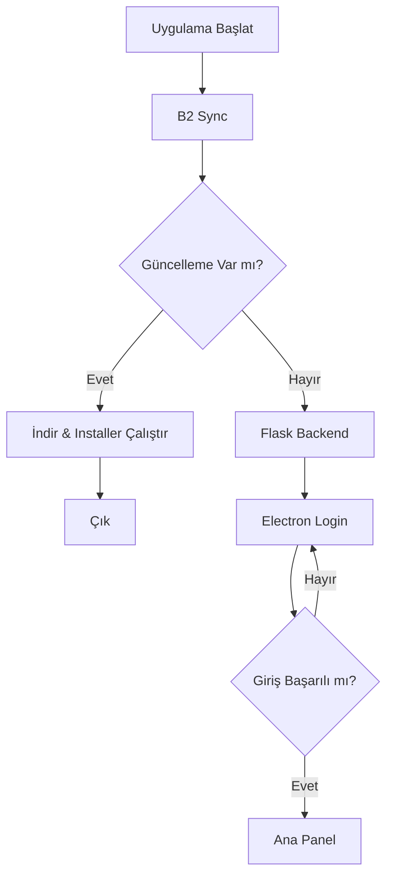

# EnvanterQR Masaüstü Uygulaması

Tam ekran Electron arayüzü + Flask backend + Neon PostgreSQL + Backblaze B2 senkronizasyonu.

## Başlangıç Akışı
```
Start App
  → Run B2 Sync (upload/download eksikler)
  → Check Version Update
      ↳ Yeni sürüm varsa: indir + installer.exe çalıştır + çık
  → Start Flask Backend
  → Open Electron Login Window
  → User Login
  → Main App (Ana panel)
```

## Dizim
```
backend/
  startup_orchestrator.py   # Açılış sırası ve update + frontend başlatma
  update_checker.py         # metadata.json temel sürüm kontrolü
  api_blueprint.py          # /api/update/check, /api/auth/login, /api/sync/run
  scheduler.py              # APScheduler periyodik B2 sync
frontend/electron/
  package.json
  main.js                   # Tam ekran pencere
  preload.js
  login.html
  main.html
app.py                      # Mevcut büyük Flask uygulaması + blueprint + scheduler
b2_file_sync.py             # Çoklu kategori B2 sync (qr_codes, reports, part_photos)
requirements.txt
```

## Çevre Değişkenleri (.env)
| Değişken | Açıklama | Örnek |
|----------|----------|-------|
| CURRENT_VERSION | Yüklü uygulama sürümü | 1.0.0 |
| UPDATE_METADATA_URL | metadata.json kaynağı (URL veya dosya) | https://example.com/metadata.json |
| AUTO_UPDATE | true => kullanıcı onayı almadan güncelle | false |
| ENABLE_PERIODIC_SYNC | Periyodik B2 sync aç/kapat | true |
| B2_SYNC_INTERVAL_MINUTES | Sync aralığı | 15 |
| B2_KEY_ID / B2_APP_KEY / B2_BUCKET_NAME | B2 erişim bilgileri | ... |
| DATABASE_URL | Neon PostgreSQL bağlantı URI | postgres://... |

## metadata.json Örneği
```json
{
  "latest_version": "1.1.0",
  "download_url": "https://example.com/installer.exe",
  "release_notes": "Performans ve hata düzeltmeleri"
}
```

## Çalıştırma
```powershell
pip install -r requirements.txt
setx CURRENT_VERSION "1.0.0"
python backend\startup_orchestrator.py
```
Electron otomatik login ekranını açar; Flask backend 5000 portunda.

## Periyodik Senkron
APScheduler ile varsayılan her 15 dakikada `b2_file_sync.py` senkronizasyonu.
Elle tetik: `POST http://localhost:5000/api/sync/run` (admin session gerekir).

## Ana Mimarî Bileşenler
- Flask + SQLAlchemy: Envanter, kullanıcı, QR verisi
- Neon PostgreSQL: Kalıcı veri
- Backblaze B2: Medya ve QR/resim yedekleri
- Electron: Login + Ana Panel (tam ekran / ikon)
- APScheduler: Arka planda periyodik B2 sync

## Gelecek Geliştirmeler
- Ana panelde gerçek kullanıcı bilgisi endpoint'i
- Update sürecinde Electron içi popup onayı
- Offline senkron hata yeniden deneme kuyrukları
- Role bazlı yetki ve audit log genişletme

## Akış Diyagramı (Mermaid)


## Lisans
İç kullanım amaçlı; telif metni eklenmedi.
